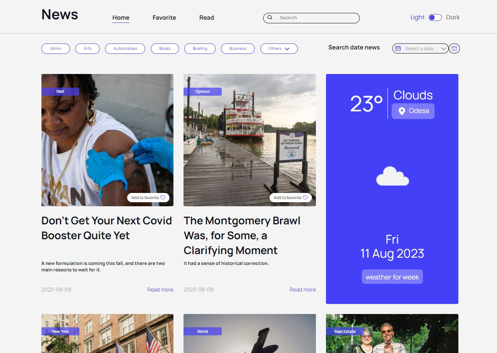
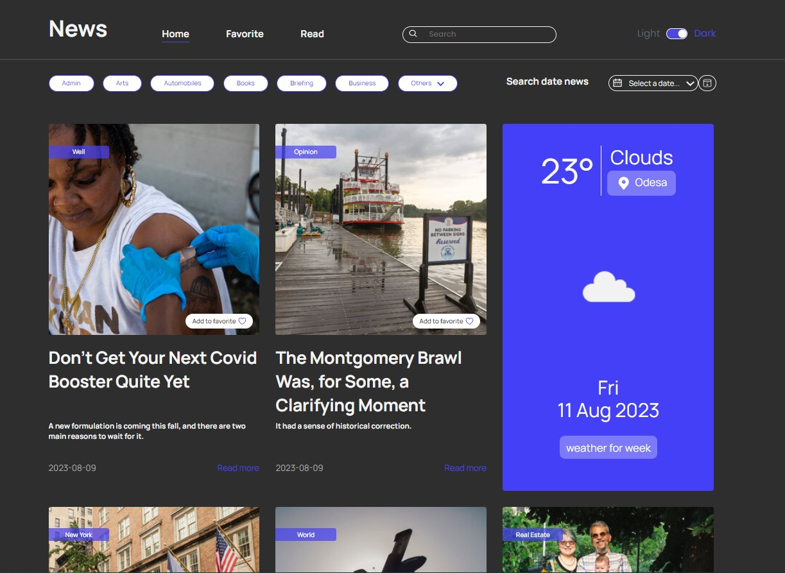

## App view

## Description of the project

A website with adaptive layouts desing for News site.

## Implemented

1. This application comprises three main sections: Home, Favorites, and Read.

2. Upon launching the Home section, you'll be presented with the most recent and popular news articles. This area allows you to explore articles of your interest. You have the ability to search articles based on dates, categories, and specific keywords. The Home section also features a weather widget to provide you with current weather information.

3. You can mark articles you like as favorites by clicking the "Add to Favorites" button. These favored articles will be saved to your device's Local Storage.

4. In the "Read" section, you can access articles that you've already read. These articles are also stored in your device's Local Storage.

5. The application's header includes navigation links between the different sections and a theme switcher. In the mobile version of the app, these elements are accessible through the mobile menu.

## Technology stack:

## Team of developers:

- [Serhii Vasylenko](https://github.com/serhii-vasylenko) - Team-lead (Frontend), developer
- [Yuliia Rudenko](https://github.com/yulyarudenko88) - Scrum master, Frontend developer 
- [Oleksandra Stusova](https://github.com/OleksandraSt) - Frontend developer
- [Iryna Akulova](https://github.com/IraAkulova) - Frontend developer
- [Liudmyla Cheremisina](https://github.com/Liudmyla-ukraineif) - Frontend developer
- [Daniil Popov](https://github.com/DaniilPopov0809) - Frontend developer
- [Inna Khavrat](https://github.com/khavrat) - Frontend developer
- [Tetiana Prokopchuk](https://github.com/lovember26) - Frontend developer
- [Kateryna Nikitina](https://github.com/KaterynaNikitina) - Frontend developer

## Link to web app:
[Link to web app](https://serhii-vasylenko.github.io/news-app-team12/)